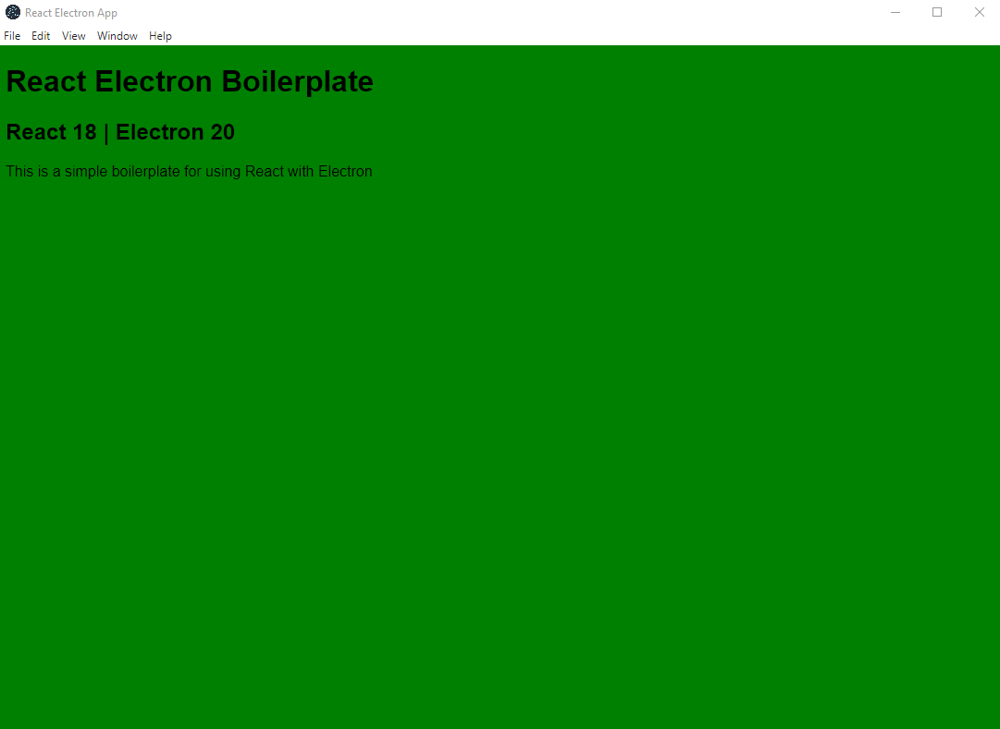

## Simple Electron React Boilerplate

- Electron 20
- React 18
<p align="center"></p>

This is a simple boilerplate to get up and running with Electron and React. It is a customized version of [Alex Devero's](https://github.com/alexdevero/electron-react-webpack-boilerplate)

# Table of Contents

- [Table of Contents](#table-of-contents)
- [Dependencies](#dependencies)
- [Instructions](#instructions)
- [Usage](#usage)
  - [Running the app](#running-the-app)
  - [Building the app (automatic)](#building-the-app-automatic)
  - [Build the app (manual)](#build-the-app-manual)
  - [Testing the app (after `npm run build` || `yarn run build`)](#testing-the-app-after-npm-run-build--yarn-run-build)

# Dependencies

```
├── @babel/core@7.18.13
├── @babel/preset-env@7.18.10
├── @babel/preset-react@7.18.6
├── babel-loader@8.2.5
├── babili-webpack-plugin@0.1.2
├── cross-env@7.0.3
├── css-loader@6.7.1
├── electron-dev@1.0.1
├── electron-devtools-installer@3.2.0
├── electron-packager@16.0.0
├── electron@20.1.1
├── file-loader@6.2.0
├── html-webpack-plugin@5.5.0
├── mini-css-extract-plugin@2.6.1
├── react-dom@18.2.0
├── react@18.2.0
├── style-loader@3.3.1
├── webpack-cli@4.10.0
├── webpack-dev-server@4.10.1
└── webpack@5.74.0
```

# Instructions

- Clone this repo
- Install dependencies `npm install` or `yarn install`
- Change the app title in the `webpack.build.config.js` and the `webpack.dev.config.js` files
- Work from the `src/components/App.js` file

# Usage

## Running the app

- `npm run start` or `yarn start`

## Building the app (automatic)

- `npm run package` or `yarn package`

## Build the app (manual)

- `npm run build` or `yarn build`
  n build

## Testing the app (after `npm run build` || `yarn run build`)

- `npm run prod` or `yarn prod`
